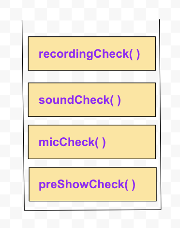

# Functions and Variables in JS
## Objectives
- Demonstrate a strong understanding of JavaScript functions
    - Define functions as First-class functions 
    - Invoke functions 
    - Define parameters and pass arguments 
- Declare Variables and understand scope of a variable
    - Demonstrate Function Scope
    - Demonstrate Block Scope
    - Demonstrate Lexical Scope
    - Understand Hoisting and Context
- Understand the call stack 
    - Explain Execution Context 
- Debug the code
    - Use the browser console to test code
    - Demonstrate Console.log
    - Know how to look up the other console methods 
    - Demonstrate Debugger 
- Preview Arrays
    - Index in array
    - Access single element in array and objects

## Outline
```txt
5 min - The Set up 
5 min - The Console
10 min - JavaScript function definition
10 min - Scope, var, let and const
10 min - The Callstack 
10 min - Introduce Arrays
5 min - Check for understanding / Exit Ticket
---
60 min
```

### The Set up - (5 minutes)
Take a second to go over our file structure. 
Lightly touch on how our JavaScript  file is being rendered  by our script tag in our index.html. We are going to be playing around in the console so we shouldn’t need a deep dive into the DOM yet. 

### The Console - (5 minutes)

Open up your dev tools and give a quick tour, touching on the element and network tabs but mostly focus on the console. 

Test out some code in the console and do a quick review of some primitive types and operations  
```
typeof 'cat'
// "string"

typeof 42.12
// "number"

typeof true
// "boolean"

!true
// false

!!true
// true

!!0 
// false 

!!''
//false

typeof undefined
// "undefined"

typeof null
// "object"

null === null

1 + 1 
// 2

let cat = 'rose'

```

### Demo JavaScript function definition - (10 minutes)
Now open your index.js and start by adding a console.log at the top and showing it in the browser console. 
```
console.log('hi computer')

```

The rest of our code will live in here. We will be making an app to help run a Flatiron podcast. We will be building out functions that will log information to our console, such as guest name, episode topics and so on.... Lets start by making a function introduction. Review the difference between a function definition and function invocation 
  

```
function introduction(){
     console.log(`Thanks for tuning in to the Flatiron Podcast, where we talk about techniques for learning coding`)
} 

console.log(introduction) //reference
console.log(introduction()) //invocation

```
Remove or comment out console.logs as you go to keep console clear
Now let’s do the same but with arrow syntax!

```
let guestAppearance = () => {
    let guest = prompt('Welcome to the Flatiron Podcast, what is your name?');
    //The return value here will be passed on 
    return guest
}

//call in console
guestAppearance()

```

Next, lets show off how to do one line implicit returns with arrow functions.

```
let sayHi = () => console.log('Hello, happy to be here thanks for inviting me to come on your podcast')
```

Now that we’ve covered the basics with function definition let’s start adding arguments and parameters. Now is a good time to talk about the difference between the two.
 
 ```
 let whereToListen = location => console.log(`To hear more episodes go to ${location}`)

 let thisWeeksSubject = (week, topic) => console.log(`It's week ${week} and this weeks topic will be...${topic}`)

 whereToListen('spotify)
 thisWeeksSubject('one', 'Functions and Variables in JS')

```

<!-- ### Demo callbacks and higher order functions - (10 minutes)
We will be passing our first callback so now is a great time to cover what makes JavaScript functions are first-class.

What makes them first-class functions is their ability to be passed as arguments and returned by other functions like any other variable. 

Lets define a function that welcomes our guest and pass it our guestAppearance function from earlier. Lets demo the same welcomeGuest a second time but use an anonymous function. 

welcomeGuest here is our Higher Order function as the one taking the callback as an argument, while guestAppearance and our anonymous function are both examples of callbacks 

As our last example lets build a function to payGuest that takes a base pay. This time we will define and return the function within the functional scope of payGuest
```
    //Higher order functions and callbacks
function welcomeGuest(callback){
    // console.log('From Inside of Higher Order')
    // The return value of the callback will be passed to this console.log 
    console.log(`Please help us welcome our guest! ${callback()}!`)
}
 
welcomeGuest(guestAppearance)

welcomeGuest(() => prompt('Welcome Back to the Flatiron Podcast, remind us what your name was?'))


function payGuest(base) {
    //anonymous function
    //defined and invoked 
    return function(numOfAppearance) {
        console.log('guest pay: ' + numOfAppearance * base)
   }
 }

``` -->

### Demo Scope, var, let and const - (10 minutes)


We are going to cover, global, functional, and block scope next. Start by creating a variable in the global scope. Write a function, recordShow(), and create a variable in the scope of the function. console.log both variables inside of functional scope to show that it has access to both variables. Next, console.log both the variables in the global scope to show that we only have access to the variable we defined in the global scope.

```
//host is in global scope
let host = 'Rose'

function recordShow(){
    //epName is in function scope  
    let epName = 'ep2. JavaScript Scope'
    console.log(`${epName} with ${host}`)
    introduction()
}

recordShow()
console.log(host)
console.log(epName)

```

This is a good opportunity to cover the issue with var. Since var allows us to access variables in block scope, it has the potential of causing bugs in the future. It’s best practice to use let in most situations you would use var.

```
if('cat'=='cat'){
    //cookie and cookie2 are in block scope
    var cookie = 'peanut butter'
    let cookie2 = 'snickerdoodle'
} 

console.log(cookie)
console.log(cookie2)
```

Finish this section off by defining a variable that can't be over written with const. 

```
const producer = 'Paul'
//producer = 'bill'
```

### The Callstack - (10 minutes)

The callstack gives us hierarchy and order of operations for function calls. 
When something is invoked it's added to the callstack and it's not removed until it's resolved. 


```
function twoThree(){
    return `${testingOne()}, two three`
}

function testingOne(){
    return `Testing one`
}

console.log(twoThree())

function preShowCheck(){
    console.log('begin pre-show check')
    micCheck()
    console.log('done with preShowCheck')
    return
}

function micCheck(){
    console.log('testing one two three')
    soundCheck()
    console.log('done with mic Check')
    return
}

function soundCheck(){
    console.log('can you hear the beep?')
    recordingCheck()
    console.log('done with sound check')
    return
}

function recordingCheck(){
    console.log('playing back recording... sounds like everything is fine')
    console.log('done with recording check')
    return 
}

preShowCheck()
```


### Introduce Arrays
An array is a list of elements. The elements are stored at a specific index location in an array. Elements can be pushed things to the end of the list and pop them off. Elements can be added to the start of the list by shifting everything down or removed from the front by unshifting all the elements up. You can reassign a value at a given index.    

```javascript
// Array
let episodes = ['Are Arrays Objects?', 'Why 3 Variable types?', 'Forms and Requests Methods', 'All about GraphQL']
```
### Access array values - (5 minutes)
An array’s elements can be accessed through bracket notation, they can be read or resigned new values. push() adds elements to the end of an array, while pop() removes them. unshift() adds elements to the front while shift() removes them from the front.
Slice and Splice can also be touched on here.

```javascript
//Access array values through index
    console.log(episodes[0])
    console.log(episodes[2])
    console.log(episodes[episodes.length-1])
// reassign index value
    episodes[0] = 'Adventures in the DOM'
    console.log(episodes)

//push item to the end of an array
    episodes.push('Handling CORS')
    console.log(episodes)
//pop item off the end of an array
    episodes.pop()

//unshift item to the front of the array
    episodes.unshift('Event Listeners')

//shift items off the front of the array
    episodes.shift()
```


### Check for understanding - (5 minutes)
End the lecture with a quick walk-through of what was covered and ask a question to check for understanding. For example, create a function that will invoke several of the functions you've made throughout the demo and ask students to explain their understanding of the callstack. 